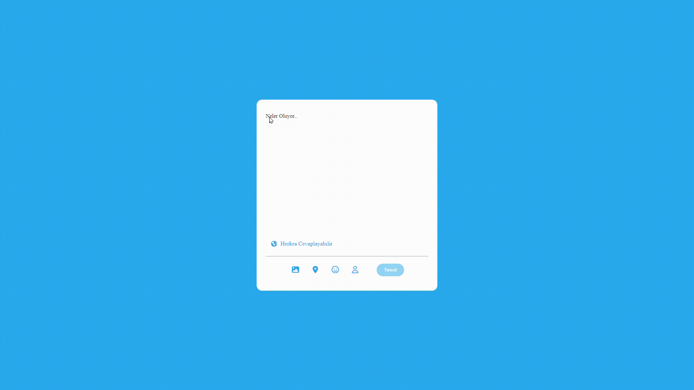

<h1> Twitter  Tweet Atma Projesi JS </h1>

  * Javascript kodları main dosyasında yer almaktadır.  
  * Htm kodlarımız index.html dosyasında yer almaktadır. 
  
 

 <h2> Yapılan İşlemler <h2>

* Kullanıcı inputa  tıkladıgında rengın değişmesi     
* Klavyeden giriş oldugunda placeholderın kaybolması  
* Klavyeden giriş yapılmadıgında placeholderın tekrar gelmesi 
* Eğer klavye girişi varsa tweet butonu aktif olacak  
* Eğer kullanıcı limiti geçmişse tweet butonu pasif olucak 
* Ve eğer kullanıcı limiti geçmişse girilen fazla değerlerin arkaplanı kırmızı olucak  

Bu işlemleri javascript ile gerçekleştirdik 

<h2>Kullanilan Teknolojiler</h2>

-CSS   
-HTML 
-JAVASCRİPT 

<h1>Proje Gif</h1>

# TweetatmaJS
